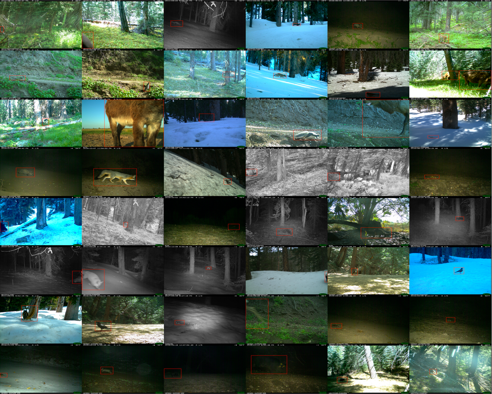
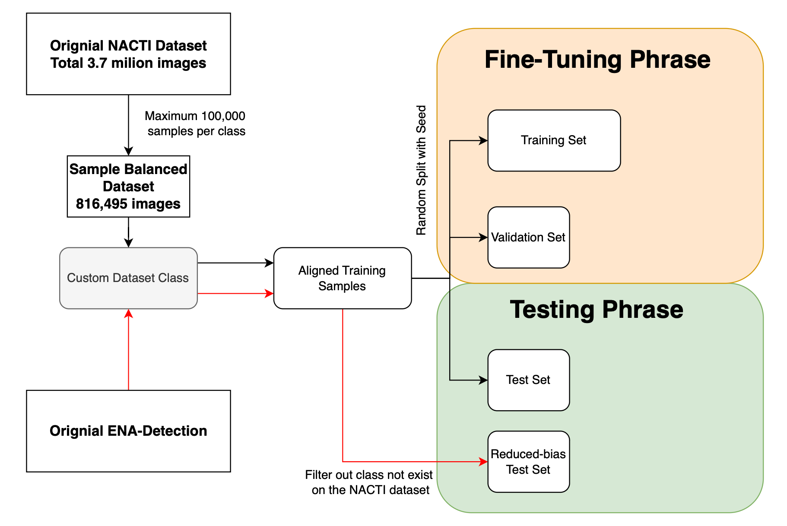

# Species-Classification

**Research code for long-tailed wildlife species classification (NACTI) and robustness evaluation.**  
Paper: *Long-tailed Species Recognition in the NACTI Wildlife Dataset* (arXiv:2510.21657)


[](https://arxiv.org/abs/2510.21657)

---

## Overview

This repository contains the training and evaluation code used in our study on **long-tailed species recognition** for large-scale camera-trap data.  
The focus is on improving **minority-class performance** under severe class imbalance, and assessing **robustness under distribution shift**.

If you use this codebase in your work, please cite the paper (see [Citation](#citation)).

---

## Key Features

- **Long-tail aware training**: supports long-tail losses / reweighting strategies (see paper for details).
- **Scalable fine-tuning pipeline**: designed to run on a single GPU or multi-GPU environments.
- **Practical project layout**: experiments, scripts, and utilities are organised for reproducible research.

---

## Table of Contents

- [Installation](#installation)
- [Project Structure](#project-structure)
- [Data Preparation](#data-preparation)
- [Quick Start](#quick-start)
- [Training](#training)
- [Evaluation](#evaluation)
- [Reproducing Paper Results](#reproducing-paper-results)
- [Model Weights](#model-weights)
- [Citation](#citation)
- [Acknowledgements](#acknowledgements)
- [Contact](#contact)

---
## Installation 

### 1) Clone the repository
```bash
git clone https://github.com/ZehuaLiuY/Species-Classification.git
cd Species-Classification
```

### 2) Create a Conda environment (recommended)

This repo provides Conda environment YAML file(pt-wl) under `envs/`.  
Create the environment directly from the YAML to ensure reproducibility.

``` bash
# Option A (recommended): create from YAML
conda env create -f envs/pt-wl.yml
conda activate <ENV_NAME>
```

### Option B (fallback): minimal environment
``` bash
conda create -n species_classification python=3.9 -y
conda activate species_classification
pip install pytorch-wildlife
```
---

## Project Structure

```
Species-Classification/
├─ envs/                    # Environment configs (optional but recommended)
├─ finetune/                # Fine-tuning scripts (entrypoints live here)
│  └─ FineTuneMega.py (main single-GPU training script)
│  └─ train_ddp.py (multi-GPU example)
├─ reference/               # Paper references / notes
├─ src/                     # Core code for methods / training utilities
├─ tools/                   # Helper scripts (pre/post-processing, utilities)
└─ README.md
```

---

## Data Preparation

### Datasets

This repo is built for camera-trap species classification and long-tailed evaluation.
You will need to prepare the dataset splits and annotations locally (datasets are **not** included in this repo).

**Recommended workflow** (typical for camera-trap pipelines):

1. (Optional) animal detection (e.g., MegaDetector-style pipeline).
2. species classification training on cropped regions
3. evaluation on:
   * standard in-distribution test split
   * robustness / reduced-bias split if applicable

### Where to put data

You can store data anywhere on your machine/server, unzip directly from the lila.science downloads.

### Configure paths

Dataset paths are typically configured inside the training script entrypoint.
Start from:

* `finetune/FineTuneMega.py`

Search for path variables / dataset initialisation in that file and replace them with your local paths.

---

## Quick Start

From the repository root:

```bash
cd finetune
python FineTuneMega.py
```

This is the simplest single-command entrypoint to start fine-tuning (after you configure dataset paths inside the script).

---


## Training

### Single GPU

```bash
cd finetune
python FineTuneMega.py
```

### Multi-GPU (DDP)

If your environment supports `torchrun`, you can launch multi-GPU training as:

```bash
cd finetune
torchrun --nproc_per_node=<NUM_GPUS> FineTuneMega.py
```

For cluster usage (e.g., SLURM), adapt the launcher to your scheduler and pass the appropriate DDP settings.

---

## Evaluation

Evaluation scripts may live in one of the following locations depending on your workflow:

* `finetune/` (training-adjacent evaluation)
* `tools/` (general utilities)
* `src/` (library-style code)

A typical evaluation flow is:

1. load a trained checkpoint
2. run inference on test split(s)
3. report metrics (overall accuracy + per-class performance, long-tail slices)

---

## Reproducing Paper Results

To reproduce results reported in the paper, you generally need:

* identical dataset version & splits
* same pre-processing pipeline (if using detection/cropping)
* same training recipe (loss, optimiser, scheduler, batch size, epochs, seeds)
* the same evaluation protocol (including any reduced-bias / OOD test sets)

---

## Citation

If you use this repository, please cite:

```bibtex
@misc{liu2025longtailednacti,
  title        = {Long-tailed Species Recognition in the NACTI Wildlife Dataset},
  author       = {Liu, Zehua and Burghardt, Tilo},
  year         = {2025},
  eprint       = {2510.21657},
  archivePrefix= {arXiv},
  primaryClass = {cs.CV}
}
```

---

## Contact

For questions, issues, or collaboration:

* GitHub Issues: [https://github.com/ZehuaLiuY/Species-Classification/issues](https://github.com/ZehuaLiuY/Species-Classification/issues)

* Email: Zehua Liu (liuzehuazxy@163.com) for model weights requests.
